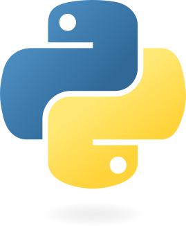
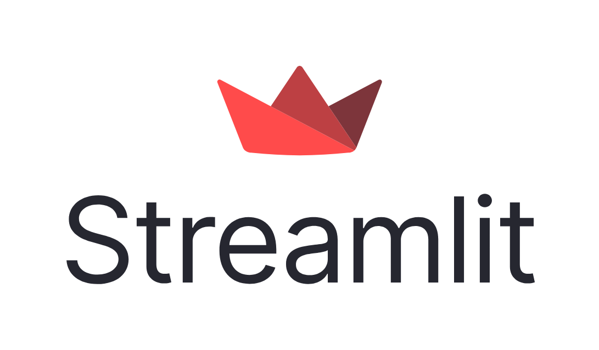
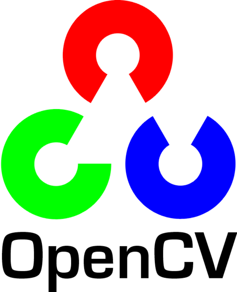
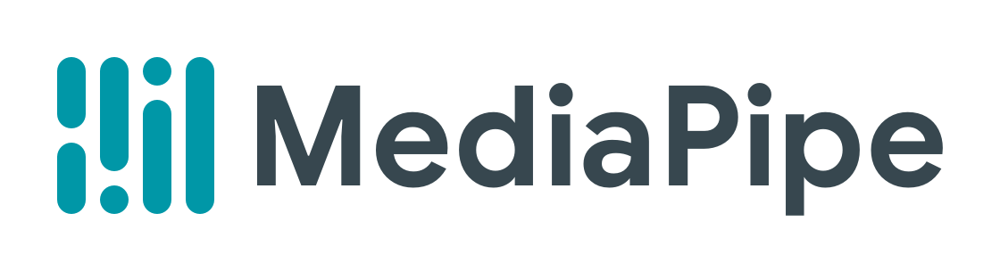

# VirtuSense Head-Nod Assistant - 🤖
[](https://opensource.org/licenses/Apache-2.0)
[]()
## Project Overview
Countless of elderly people need constant attention to their needs. It is mighty challenging for them to engage in day to day conversations, and
call for help. The VirtuSense Head-Nod Assistant is an AI powered personal assistant that keeps patients in check of their needs and necessities and also offer a peice of entertainment. An AI-powered web app , designed to interact with users through a single thought-provoking question that expects a "Yes" or "No" head-nod..

##  Tools Used
   

## Package Structure

The head-nod application is structured into following components: 
- `images/` : Folder containing deployment use cases
- `app.py`: The main Streamlit application.
- `Dockerfile`: Instructions for Docker to build the application image.
- `detetctor.py`:  The main detector algorithm using mediapipe and OpenCV.
- `utils.py` : File consisting record and save video utlity for the application.
- `interaction.txt`: File for interaction storage with time stamp.
- `video_logs/`: Folder containing video_log files.
- `open_browser.sh`: The bash file for opening web browswer.
- `open_cam.sh`: The bash file for opening camera.

## Dependencies 
For the application, you are required to have docker installed. To install docker, follow the instructions given on the link [Docker Installation Guide](https://docs.docker.com/desktop/install/linux-install/).

Further ensure, you have git installed in your device OS. If not you can install git by just using the following command:
```bash
    sudo apt install git-all
```

## Application Deployment
1. **Git clone the repository**
    First step is to clone the whole repository. 
    ```bash
    git clone https://github.com/Achuthankrishna/head_pose_app
    ```
    Get into the folder
    ```bash
        cd head_pose_app
    ```
2. **Build the Docker Image**
   In the command line first execute:
   ```bash
   docker -v
   ```
   to check your docker version. Once done , execute the command below to build the container: 
   ```bash
   sudo docker build -t head_pose_app .
   ```

3. **Start the Container**
   To start the streamlit web application, run:
   ```bash
   sudo docker run -privileged -v /dev/video0:/dev/video0 -p 8501:85001 head_pose_app
   ```
   This command then map the port 8501 of the container to port 8501 on your host machine.

4. **Click the link on the terminal**
    Last step is to either click on the link on terminal , else type
    ```bash
    localhost:8501
    ``` 
    on any browser on the system.

## Software Documentation
1. Open your web browser and navigate to `http://localhost:85001` or click on the link presented on the terminal.
2. The user will be presented with a web interface given with instructions on how to nod and key analogies.
3. Click on `Start` , to start the application, else if user is not feeling the moment to use the application, they can press `Quit App` to kill the process.
4. Read the question on the side bar and press on `Answer Question` to open the interface, else the user wants to skip question, they can press `Change Question`.
5. When pressed `Answer Question` , a countdown will be presented to the user , upon which the camera frame opens up for their response.
6. The software first records the interaction in a 3 second window. If the detector can't detect any proper sign, it will keep prompting the user to re-record their interaction.
7. At any point of time user can skip to the next question pressing `Change Question` button or can quit the app pressing `Quit App`. Once the user answers the given question, the detector presents the output.
8. The user can either choose to re-answer if they're not satisfied with the detection , else can press continue to log their interaction for the question.
9. Upon completing all Questions, the webapp will present the option of either to restart from first or quit the application. On presseing `Restart` the application starts recording response from the first question.

## Methodology Adopted 
- The detection algorithm is majorly functioning on majority action recorded for the frame time. These actions are decided by first obtaining   facial landmarks using mediapipe blendshape and FaceMeshV2 model. 
- The obtained facial landmarks are indexed and I chose the nasal index and the extreme cheekbone index, which can be viewed from this [image](https://github.com/google/mediapipe/blob/a908d668c730da128dfa8d9f6bd25d519d006692/mediapipe/modules/face_geometry/data/canonical_face_model_uv_visualization.png)
- From the obtained indices, we record all 3d and 2d locations of the landard for each frame and use PnPSolver to get rotation and translation vector. Further we obtain rotation matrices using Rodrigues formula.
- Based on the Euler angles, the I classifies the predominant motion of the face. If the rotation about the y-axis (y) is significant (beyond a threshold), it indicates looking left or right. If the rotation about the x-axis (x) is significant, it indicates looking up or down. Otherwise, the face is considered to be facing forward.
- Then  we count the occurrences of different types of motions and identify the predominant motion over the 3 second frame.Based on the predominant motion, the function returns the response, categorizing it as "Yes", "No", or "Undetermined" .

## Troubleshooting
- If user encounter any issues with the video recording, ensure your Docker is configured correctly. The application is best developed for a **debian device** where camera device ID is accessible and not truncated.
- Any issues with dependency versions, refer to `requirements.txt` and adjust the package versions if necessary.

## Deployment Videos 

### Case 1: User Responds Yes and Quits App: 
[!Image: Yes and Quit](./images/yes-quit.gif)